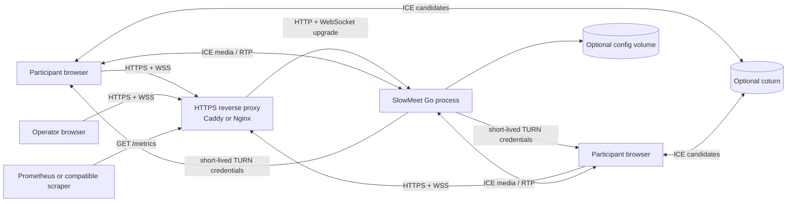
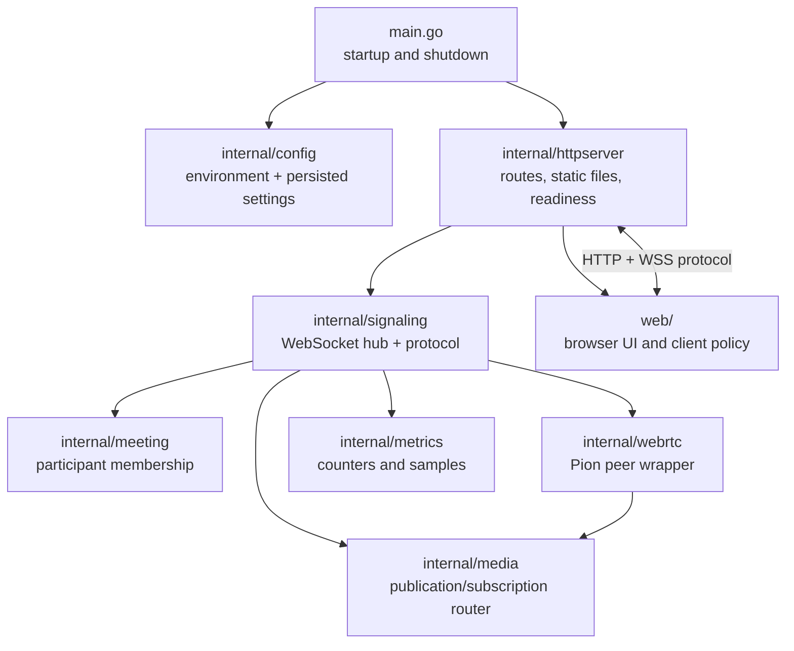
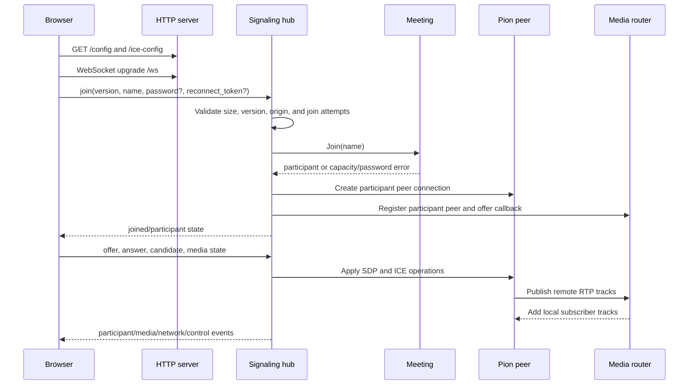
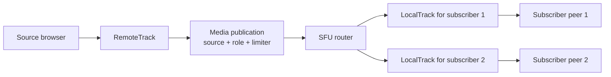

# SlowMeet Architecture

## Overview

SlowMeet is a single-process Go service with embedded browser assets. It serves
the meeting UI and operational endpoints, terminates WebSocket signaling, owns
the active meeting state, creates Pion WebRTC peer connections, and forwards
RTP between participants through an SFU-style media router.

There is no database in the meeting path. The active meeting and its media
state live in memory. Configuration can be loaded from environment variables
and persisted as a small JSON file for runtime settings.

## System context



The reverse proxy terminates TLS and must preserve WebSocket upgrade headers.
WebRTC media may flow directly to the application over the configured ICE UDP
range or through TURN when direct connectivity is unavailable.

## Runtime components



### `main.go`

Loads configuration, constructs the HTTP application, starts the server, and
handles SIGINT/SIGTERM. Shutdown closes the application and waits up to ten
seconds for the HTTP server to stop.

### `internal/config`

Defines environment-backed settings, validation, effective media defaults,
and optional JSON persistence. Persistence uses a temporary file, restrictive
permissions, and rename-based replacement so a failed write does not replace a
valid configuration with a partial file.

### `internal/httpserver`

Builds the HTTP mux and wires health, readiness, public configuration, ICE
configuration, metrics, admin configuration, WebSocket, static asset, and
admin-page routes. Frontend assets are embedded in the Go binary through
`web/embed.go`.

### `internal/signaling`

Owns WebSocket clients, protocol validation, authentication during join,
participant lifecycle, signaling fan-out, reconnect handling, chat/reaction
rules, screen-share ownership, media-state updates, and metrics collection.

### `internal/meeting`

Owns active participant membership and capacity enforcement. It is deliberately
small and independent of transport and WebRTC details.

### `internal/webrtc`

Wraps Pion peer connections, transceivers, ICE candidates, SDP operations, and
connection lifecycle callbacks.

### `internal/media`

Maintains published tracks and peer subscriptions. A publication has one
source peer and may have multiple local tracks for subscribers. The forwarding
loop reads RTP from the remote track and writes it to subscribed local tracks.

### `internal/metrics`

Stores counters and latest network/media samples used by `/metrics` and the
operations cockpit.

## HTTP surface

| Route | Purpose | Protection |
| --- | --- | --- |
| `/` | Meeting application | Public |
| `/admin` | Redirect to the operations cockpit | Public page; data requires admin password |
| `/health` | Liveness check | Public |
| `/ready` | Readiness check | Public |
| `/config` | Non-secret meeting/media configuration | Public, no-store |
| `/ice-config` | Browser ICE server configuration | Public, no-store; credentials are generated or selected server-side |
| `/metrics` | Prometheus-compatible service and network metrics | Public in the current implementation; protect at the proxy if required |
| `/admin/config` | Read or update runtime settings | `X-Admin-Password` when admin access is enabled |
| `/ws` | Versioned signaling WebSocket | Origin and protocol validation |

The application itself listens on `HTTP_ADDR`, port `8080` by default. TLS is
expected at the reverse proxy rather than inside the Go process.

## Join and signaling flow



The signaling protocol is JSON with `version: 1` and a required `type`. The
current message vocabulary includes join/leave, participant announcements,
offer/answer/candidate, ICE restart, media state, hand state, network state,
screen-share state, configuration updates, chat messages, emoji reactions, and
errors.

The server validates message-specific required fields and bounds. Chat text is
limited to 500 runes, reactions are restricted to an approved set, and network
measurements are range-checked before they affect diagnostics or metrics.

## Meeting and reconnect state

The meeting package owns membership, while the signaling hub owns the
transport-specific association between a WebSocket client and a participant.
Disconnect handling removes the transport immediately and applies the
configured reconnect behavior before final participant cleanup.

The reconnect token is a browser-held identifier used to associate a new
connection with the previous participant when it reconnects within the allowed
window. It is not a password and must not be logged or exposed in diagnostics.

When a participant leaves permanently, the hub removes its peer connection,
unregisters it from the media router, releases screen-share ownership, updates
metrics, and broadcasts the leave event.

## WebRTC and SFU media path



The router tracks peers, offer callbacks, and publications. When a peer joins,
existing publications are subscribed to it. When a new publication appears,
the router adds it to other peers and asks the relevant offerers to renegotiate.

The forwarding loop:

1. Reads an RTP packet from the source remote track.
2. Applies the video FPS limiter when configured.
3. Applies the non-queuing bitrate token bucket.
4. Drops the packet when the limit is exceeded.
5. Writes the packet to each subscriber local track.

This design intentionally does not transcode or wait for tokens. Dropping is
preferred to queueing because queueing would increase latency and make a slow
connection consume unbounded memory.

Runtime media-limit changes update existing limiters as well as the defaults
used by new publications.

## Browser architecture

The browser assets are embedded and served by the Go process. The main client
coordinates:

- initial configuration and ICE discovery;
- WebSocket lifecycle and protocol parsing;
- local device capture and track publication;
- peer connection creation and renegotiation;
- participant tiles, active speaker, pinning, and layout;
- adaptation policy for video quality and remote-video pausing;
- diagnostics, chat, reactions, screen share, and admin UI behavior.

`web/js/protocol.js` rejects malformed signaling messages before application
logic consumes them. Browser validation complements, but never replaces,
server-side validation.

## Configuration and control plane

Configuration has two sources:

1. Environment variables provide deployment-time settings and secrets.
2. An optional persisted JSON file stores safe runtime-admin settings such as
   participant capacity, quality, bitrate/FPS ceilings, screen sharing, and
   chat retention.

The admin endpoint applies validated updates to the store and propagates
relevant media policy changes to active signaling/media state. Secrets such as
meeting and admin passwords, TURN shared secrets, and legacy TURN credentials
are not included in the public configuration response.

The operations cockpit reads health and metrics periodically. It is a view of
current state, not a durable event or audit system.

## Deployment topology

The supported deployment shape is:

```text
Browser
  │ HTTPS / WSS
  ▼
Caddy or Nginx
  │ HTTP / WebSocket upgrade
  ▼
SlowMeet :8080 ─── optional data volume for persisted settings
  │
  ├── UDP ICE range, 50000-50100 by default in Compose
  └── optional coturn for restrictive NATs
```

The Compose examples use a read-only application filesystem, a temporary
filesystem for `/tmp`, dropped capabilities, resource limits, health checks,
and a data volume. The systemd example runs as a dedicated user with
restricted filesystem access.

TURN can run as a separate optional profile. Its listeners and relay range
must be reachable from clients, and TCP/TLS listener conflicts with the HTTPS
proxy must be resolved at deployment time.

## Failure and shutdown behavior

### Client or WebSocket failure

Ping/pong deadlines detect dead WebSocket connections. The hub removes the
client and performs participant cleanup. Reconnect logic can preserve the
participant within the configured grace period.

### ICE or peer failure

Peer connection state callbacks update metrics and trigger recovery or cleanup
behavior. The browser can request ICE restart and renegotiate when a path is
recoverable.

### Source track failure

When a remote RTP track ends, the router removes its publication. Subscribers
remain connected and can receive later publications or renegotiation results.

### Process shutdown

`main.go` receives SIGINT/SIGTERM, closes the application hub, closes peer and
WebSocket resources, then calls `http.Server.Shutdown` with a ten-second
timeout.

## Security boundaries

- The browser is an untrusted signaling client.
- Protocol fields are validated on the server and WebSocket reads are size
  limited.
- WebSocket origin checks restrict browser connections to the request host
  when an Origin header is present.
- Meeting and admin passwords remain server-side.
- Admin configuration uses a request header and does not display the stored
  password in the UI.
- TURN shared-secret credentials are short-lived when configured.
- TLS, certificate handling, and public network exposure belong to the reverse
  proxy/deployment layer.

## Testing strategy

Tests are colocated with their package and cover:

- configuration defaults, validation, and persistence;
- HTTP routes, health/readiness, admin access, and WebSocket upgrade behavior;
- signaling validation, join limits, reconnects, security, chat, reactions,
  and screen sharing;
- meeting membership;
- peer wrapper lifecycle;
- media router publication, subscription, limits, and integration behavior;
- metrics formatting;
- browser protocol, adaptation, and layout scripts through Node-based checks.

The normal repository gate is `go test ./...`, supplemented by the relevant
scripts in `scripts/` and deployment smoke checks.

## Architectural invariants

1. The server is the authority for membership, passwords, limits, and protocol
   validity.
2. Media forwarding must remain non-transcoding and non-queuing.
3. Audio should remain usable when video is degraded.
4. A failed runtime settings save must not activate a partial configuration.
5. Secrets must not cross the public configuration boundary.
6. Every participant and publication must be cleaned up when its owning
   connection is gone.
7. WebSocket upgrade and HTTPS requirements must survive reverse-proxy
   deployment.

## Extension points and limits

The cleanest future extension points are the configuration store, meeting
repository boundary, signaling hub, media router, and metrics interface. Any
multi-room or horizontally scaled design must first introduce explicit room
ownership and shared signaling/state; adding a database alone would not make
the current in-memory media topology scale safely.

