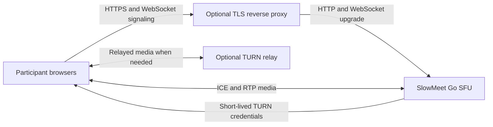

# SlowMeet

SlowMeet is a small, self-hosted video meeting app built around usable audio
and graceful degradation on unstable connections.

- One meeting room at `/`, with up to five participants by default
- Browser-persisted meeting preferences and device selections
- Camera/microphone controls, per-user remote video pause, chat, and reactions
- One active screen-share lease with disconnect cleanup
- SFU media forwarding without server-side transcoding or media buffering
- Automatic video quality reduction, audio continuity controls, and diagnostics
- Optional meeting password, runtime admin controls, and TURN relay support

## How SlowMeet handles weak connections

SlowMeet uses an SFU: each participant sends one copy of their published media
to the server, which forwards it to the other participants. This can reduce
upload demand compared with mesh calls, where participants send separate copies
to each peer. It does not remove the need for a reliable path to the server or
enough download capacity for the media each participant receives.

Automatic quality uses network measurements to lower video quality when a
connection struggles. If conditions become critical, SlowMeet can pause video
to help audio remain usable. These steps manage the available bandwidth; they
cannot create more of it or guarantee call quality.

When a network blocks direct UDP, an operator-configured TURN relay can provide
another connection path. Relaying can add latency. Simulcast layer switching
is also available, but disabled by default.

These features are not an Iran-specific optimization. Results depend on each
participant's access network and routing, as well as the location and quality
of the SFU and TURN server. Validate performance on Iranian mobile and fixed
networks before making regional performance claims.



## Run and develop locally

```sh
go run .
```

Open [http://localhost:8080](http://localhost:8080). Browser camera and
microphone access on other devices requires HTTPS; see the
[local HTTPS guide](docs/local-https.md). Native runs read configuration from
the shell environment; `go run .` does not load `.env` automatically.

Run the Go checks and browser-side protocol/adaptation checks with:

```sh
go test ./...
go build ./...
node scripts/test-protocol.js
node scripts/test-adaptation.js
```

Browser signaling and media flow are described in the
[architecture guide](ARCHITECTURE.md). For network impairment testing, see
[`docs/network-testing.md`](docs/network-testing.md).

## Deploy

For a fresh Ubuntu or Debian VPS, point your domain to the server and choose an
installer. Both commands fetch the current `master` version and are not pinned
to a release; review the script before running it with root privileges.

### Build from source

```sh
sudo bash -c 'export DEBIAN_FRONTEND=noninteractive; apt-get update && apt-get install -y ca-certificates curl && curl -fsSL https://raw.githubusercontent.com/ashkan-esz/SlowMeet/master/deploy/install.sh | bash'
```

This installer builds SlowMeet from source and configures HTTPS.

### Install a published image

This alternative installs a released container image without building the
project on the VPS. It leaves firewall, proxy, and TLS setup to the operator.

```sh
sudo bash -c 'export DEBIAN_FRONTEND=noninteractive; apt-get update && apt-get install -y ca-certificates curl && curl -fsSL https://raw.githubusercontent.com/ashkan-esz/SlowMeet/master/deploy/install-container.sh | bash'
```

For both installer guides, Docker or Podman Compose, and network-port details,
see the [container deployment guide](docs/container-deployment.md). Installer
behavior, including supported TLS port-conflict handling, is covered in the
[VPS installer guide](docs/install-script.md) and
[published-image installer guide](docs/install-container-script.md).

### Host resources

For one room of up to five participants, allow at least **1 vCPU and 1 GiB RAM**
for SlowMeet with its HTTPS proxy, or **2 vCPU and 2 GiB RAM** if coturn also
runs on that host. Treat these as practical minimum starting sizes, not
benchmarked hard requirements; allow more for heavier media use or more load.
The Compose defaults cap the app container at 0.75 CPU and 256 MiB, with coturn
adding 0.20 CPU and 128 MiB when enabled. Those container limits do not include
the host operating system or other services.

## Configuration and operations

The server reads configuration from environment variables. `.env` files are
read by Compose, but are not loaded automatically by `go run .`. Keep passwords
and TURN credentials private. Set `MEETING_PASSWORD` to protect meeting entry
and `ADMIN_PASSWORD` to protect `/admin`. See the
[configuration guide](docs/configuration.md) for TURN, ICE, media limits, and
metrics details.
